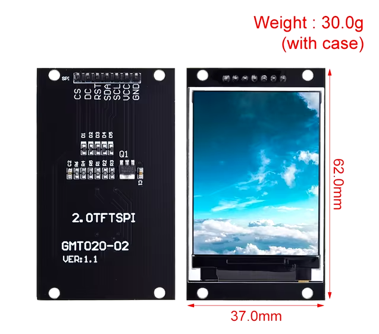

# JPEG to Array Converter for Arduino/ESP32

## Project Description
This project is a Python application for converting JPEG images into a data array that can be used in Arduino and ESP32 sketches. The program is specifically designed to work with the ST7789V 2.0-inch TFT display (240x320, SPI interface).

### How the Program Works
The program uses the Tkinter library to create a graphical interface where users can select an image for conversion. Once selected, the image is converted into an RGB565 data array compatible with the ST7789V TFT display and saved in the `image_array.txt` file.

- **RGB to RGB565 Conversion**: Each pixel is converted from RGB format to RGB565, which is suitable for TFT displays. This helps save memory and improves display speed.
- **Supported Formats**: Users can select JPEG and PNG files.
- **Array Generation**: The resulting array is saved in `image_array.txt`, where values are formatted as `0xFFFF`, separated by commas, and aligned in rows of 16 values for easier readability.

### Requirements
- Python 3.x
- Libraries: Pillow (for image processing), tkinter (for the graphical interface)

## Пример дисплея


To install dependencies:
```bash
pip install pillow
```

## Пример дисплея


Usage

1 Run the program by right-clicking on the convert.py.exe.py file, selecting "Open with," and choosing Python.

2 In the graphical interface that opens, click the "Select Image" button and choose a JPEG or PNG file.

3 The program will convert the image and save the array in image_array.txt.

4 Copy the array from image_array.txt and paste it into your sketch to display the image on the screen.

 

Installation and Running

To run the program, simply right-click on convert.py.exe.py and choose "Open with Python."

License
This project is licensed under the MIT License.
